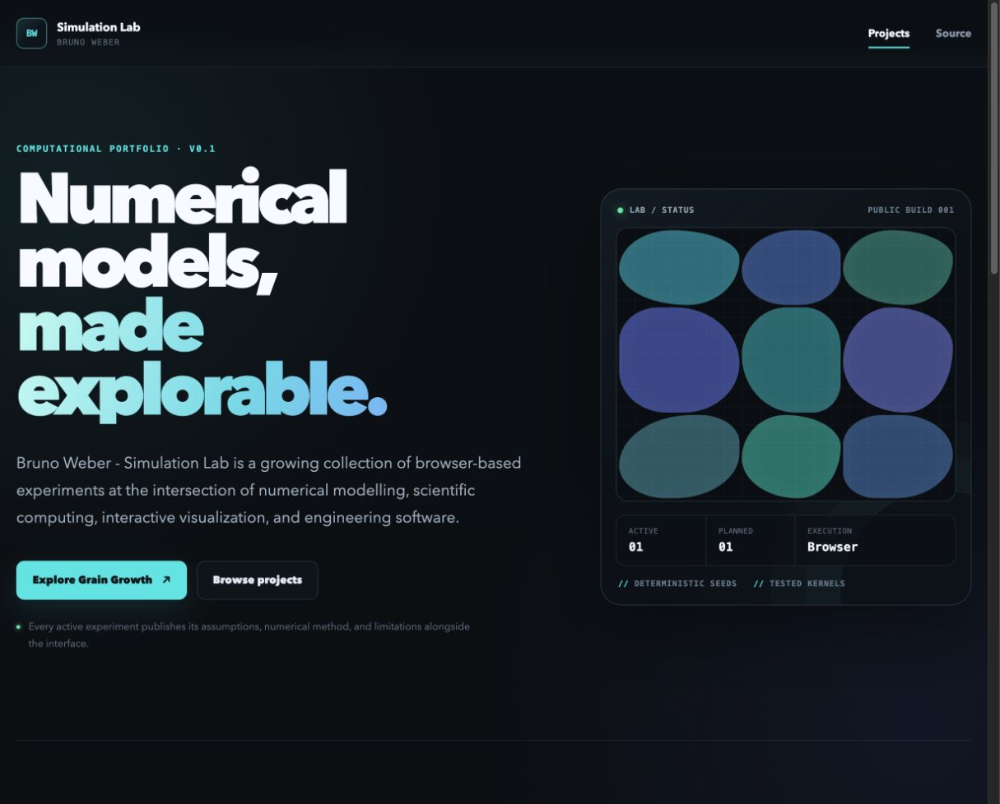

# Bruno Weber - Simulation Lab

Interactive numerical experiments across science and engineering.

[Open the live lab](https://gallant-tesla-a765dd.netlify.app/) · [Run the Grain Growth Model](https://gallant-tesla-a765dd.netlify.app/simulations/grain-growth)

Simulation Lab is Bruno Weber's public portfolio for numerical modelling, scientific computing, interactive visualization, and engineering software. Each runnable experiment places its method, parameters, assumptions, and limitations next to the result. The lab is experimental software, not a commercial product or a certified engineering tool.



## Project catalogue

| Project | Status | Method | What is available |
| --- | --- | --- | --- |
| [Grain Growth Model](https://gallant-tesla-a765dd.netlify.app/simulations/grain-growth) | Experimental | 2D neighbor-copy Monte Carlo Potts variant | Seeded initialization, in-browser evolution, live metrics, controls, model notes, and references |
| Laser FEM | Planned | Finite element method | Catalogue entry only; its governing model and implementation scope have not yet been defined |

“Experimental” means the software runs and is tested, while its scientific output remains qualitative and uncalibrated. “Planned” does not imply that a demo, result, or delivery date exists.

## Grain Growth Model

The first experiment explores qualitative grain coarsening on a periodic two-dimensional lattice. Each site carries a categorical grain label. A local stochastic update can copy a neighboring label, and the system tends to reduce the number of unlike-neighbor bonds.

The numerical engine is deterministic for a given configuration and seed, independent of React and Canvas, and executed entirely in the browser.


### State and initialization

For a square lattice of width \(L\), the number of sites is \(N=L^2\). Each site \(i\) stores a grain label \(q_i\); the label is an identifier, not a crystallographic orientation or angle.

Initialization selects \(G_0\) distinct nuclei from the lattice with a seeded pseudorandom generator. Every site is assigned to the nearest nucleus using periodic distance, producing an exact-count periodic Voronoi tessellation. Ties are deterministic. This is a reproducible geometric initial condition, not a physical nucleation model.

### Boundary energy

The model uses the eight-site Moore neighborhood and equal interaction strength \(J=1\). Each unique unlike-neighbor pair contributes one dimensionless unit:

```text
H = J Σ⟨i,j⟩ (1 − δ(qᵢ, qⱼ))
ε = H / J
```

The sum counts every undirected neighbor bond once. The engine uses \(\epsilon=H/J\), the dimensionless unlike-bond count, with \(J\) as the energy unit. The normalized unlike-bond fraction reported by the interface is \(\epsilon/(4L^2)=H/(4JL^2)\), because the periodic Moore lattice contains \(4L^2\) unique bonds. It is a discrete boundary indicator, not a physical boundary length.

### Update and acceptance rule

One attempted update:

1. Selects a lattice site uniformly at random.
2. Selects one of its eight periodic Moore neighbors uniformly.
3. Proposes copying that neighbor's label.
4. Computes the local dimensionless boundary-energy change, \(\Delta\epsilon=\epsilon_{after}-\epsilon_{before}\).
5. Accepts the proposal according to

```text
P(accept) = 1                 when Δε ≤ 0
P(accept) = exp(−Δε / θ)      when Δε > 0 and θ > 0
P(accept) = 0                 when Δε > 0 and θ = 0
```

Here \(\theta\) is dimensionless effective noise. It controls uphill moves, but it is not a material temperature. Accepted changes are applied immediately. One Monte Carlo sweep is exactly \(L^2\) attempted updates, with site selection performed with replacement; a sweep is algorithmic time, not a second.

The neighbor-copy proposal is generally asymmetric because its probability depends on local label frequency. The rule above has the Metropolis form but no Hastings correction, so this experiment must not be interpreted as exact canonical-equilibrium Potts sampling. It is a kinetic neighbor-copy variant biased toward lower boundary energy.

### Controls and metrics

The interface provides start, pause/continue, single-sweep step, restart, and default reset controls. Safe ranges are enforced for grid size, initial grain count, random seed, effective noise, and animation speed. Configuration changes are applied on restart; speed changes are immediate.

| Quantity | Meaning | Unit |
| --- | --- | --- |
| Grid size, \(L\) | Width and height of the square lattice | lattice sites |
| Initial grains, \(G_0\) | Distinct nuclei in the initial tessellation | count |
| Seed, \(s\) | Initial state of the deterministic pseudorandom sequence | dimensionless integer |
| Effective noise, \(\theta\) | Uphill-move acceptance control | dimensionless |
| Sweep | Exactly \(L^2\) attempted updates | algorithmic time |
| Active labels | Number of distinct labels still present | count |
| Boundary fraction | Unlike Moore bonds divided by \(4L^2\) | dimensionless |
| Mean area | \(L^2/G\), where \(G\) is the number of active labels | lattice-area units |
| Mean equivalent diameter | Arithmetic mean of \(2\sqrt{A_g/\pi}\) across active labels | lattice spacings |

### Assumptions and limitations

This version demonstrates qualitative two-dimensional coarsening. It:

- uses a square lattice with periodic boundaries and equal energy for all unlike Moore-neighbor pairs;
- treats labels as categorical grain IDs, not measured crystallographic orientations;
- uses a seeded Voronoi construction for readability rather than modelling nucleation;
- reports lattice and algorithmic units only;
- counts each active ID once, even if updates fragment it into disconnected regions;
- retains square-lattice anisotropy, discretization, finite-domain effects, and possible faceting;
- is not calibrated to steel, an alloy, or any other specific material;
- does not calculate phase transformations, thermodynamic phase fractions, physical elapsed time, mechanical properties, or industrial process outcomes;
- omits misorientation-dependent boundary energy and mobility, texture, solute drag, particles, and external driving forces.

Quantitative material prediction would require a governing model and parameters tied to a material, physical length and time calibration, validation data, sensitivity analysis, and uncertainty assessment.

### Scientific references

1. R. B. Potts, “Some generalized order-disorder transformations,” *Mathematical Proceedings of the Cambridge Philosophical Society* **48**(1), 106–109 (1952). [doi:10.1017/S0305004100027419](https://doi.org/10.1017/S0305004100027419)
2. N. Metropolis et al., “Equation of State Calculations by Fast Computing Machines,” *The Journal of Chemical Physics* **21**(6), 1087–1092 (1953). [doi:10.1063/1.1699114](https://doi.org/10.1063/1.1699114)
3. M. P. Anderson et al., “Computer simulation of grain growth - I. Kinetics,” *Acta Metallurgica* **32**(5), 783–791 (1984). [doi:10.1016/0001-6160(84)90151-2](https://doi.org/10.1016/0001-6160(84)90151-2)
4. D. J. Srolovitz et al., “Computer simulation of grain growth - II. Grain size distribution, topology, and local dynamics,” *Acta Metallurgica* **32**(5), 793–802 (1984). [doi:10.1016/0001-6160(84)90152-4](https://doi.org/10.1016/0001-6160(84)90152-4)
5. G. S. Grest et al., “Domain-growth kinetics for the Q-state Potts model in two and three dimensions,” *Physical Review B* **38**(7), 4752–4760 (1988). [doi:10.1103/PhysRevB.38.4752](https://doi.org/10.1103/PhysRevB.38.4752)
6. E. A. Holm et al., “Effects of lattice anisotropy and temperature on domain growth in the two-dimensional Potts model,” *Physical Review A* **43**(6), 2662–2668 (1991). [doi:10.1103/PhysRevA.43.2662](https://doi.org/10.1103/PhysRevA.43.2662)
7. D. Raabe, “Scaling Monte Carlo kinetics of the Potts model using rate theory,” *Acta Materialia* **48**(7), 1617–1628 (2000). [doi:10.1016/S1359-6454(99)00451-6](https://doi.org/10.1016/S1359-6454(99)00451-6)
8. J. K. Mason et al., “Kinetics and anisotropy of the Monte Carlo model of grain growth,” *Acta Materialia* **82**, 155–166 (2015). [doi:10.1016/j.actamat.2014.08.063](https://doi.org/10.1016/j.actamat.2014.08.063)

## Architecture

The application is a static React single-page app. Platform code and simulation code remain separate:

```text
src/
├── catalog/
│   └── projects.js                    # Central project registry and validation
├── components/                        # Shared shell and catalogue UI
├── content/
│   └── grainGrowth.js                 # Scientific copy, parameters, references
├── hooks/                              # Shared browser behavior
├── pages/                              # Landing and not-found pages
├── simulations/
│   └── grain-growth/
│       ├── engine/                     # Pure seeded numerical kernel and tests
│       ├── GrainCanvas.jsx             # Canvas rendering only
│       ├── SimulationControls.jsx      # Inputs and transport controls
│       ├── useGrainGrowthSimulation.js # React state and animation scheduling
│       └── GrainGrowthPage.jsx         # Experiment composition
├── App.jsx                             # Routes and lazy experiment loading
└── styles.css                          # Platform visual system
```

The landing page renders from the registry. Adding an experiment should primarily require a project module, its scientific content, and one registry entry; catalogue and navigation code do not need to be rewritten. The Grain Growth route is lazy-loaded so its numerical and visualization modules stay out of the landing-page bundle.

## Technology

- React 19 and React Router
- Vite 8
- Canvas 2D for the lattice renderer
- Vitest, Testing Library, and jsdom
- ESLint
- Netlify static hosting with an SPA route fallback and security headers
- GitHub Actions for lint, tests, and production build

No backend, authentication, database, analytics, CMS, or contact form is used.

## Local development

Requirements:

- Node.js 22.12 or later
- Corepack with pnpm 11.16

```bash
corepack enable
pnpm install --frozen-lockfile
pnpm dev
```

Vite prints the local URL. The main routes are `/` and `/simulations/grain-growth`.

## Verification

```bash
pnpm lint
pnpm test
pnpm build
```

Or run the complete local gate:

```bash
pnpm check
```

The test suite covers deterministic and divergent seeds, configuration limits, initialization, energy and local energy changes, acceptance decisions, attempted updates, exact sweep accounting, reset behavior, metrics, registry integrity, essential routes, and primary interface semantics.

## Production build and publishing

```bash
pnpm build
pnpm preview
```

Vite writes the production site to `dist/`. [`netlify.toml`](netlify.toml) defines that publish directory, the Node/pnpm build environment, asset caching, security headers, and the history fallback needed to load nested routes directly.

The existing Netlify site can build from the connected repository or be published by an authenticated maintainer with:

```bash
pnpm dlx netlify-cli deploy --build       # deploy preview
pnpm dlx netlify-cli deploy --build --prod
```

Git history and Netlify's immutable deploy history provide rollback points.

## Roadmap

- Validate Grain Growth behavior against selected reference cases before making quantitative claims.
- Add exportable configurations and results with explicit schema and provenance.
- Add visual regression and broader accessibility automation.
- Define the Laser FEM governing equations, domain, boundary conditions, numerical method, parameters, validation strategy, and limits before implementation.
- Add further simulation modules across science and engineering through the central project registry.

## Status and authorship

This repository is the first published version of **Bruno Weber - Simulation Lab**. The Grain Growth Model is experimental portfolio software released for inspection and learning; it is not an engineering certification or decision tool.

Created by **Bruno Weber**.

No license has been selected for this repository.
